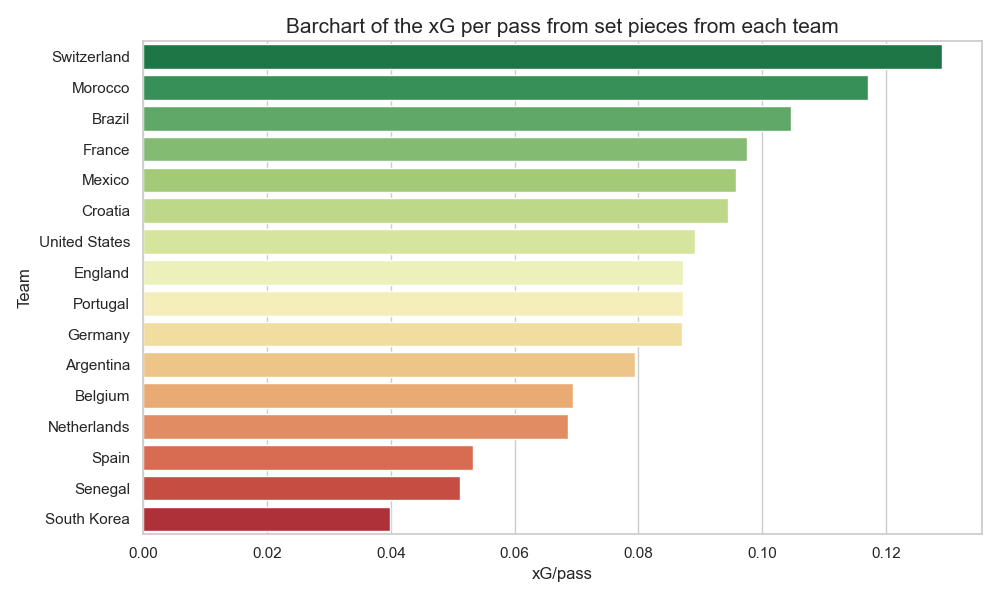
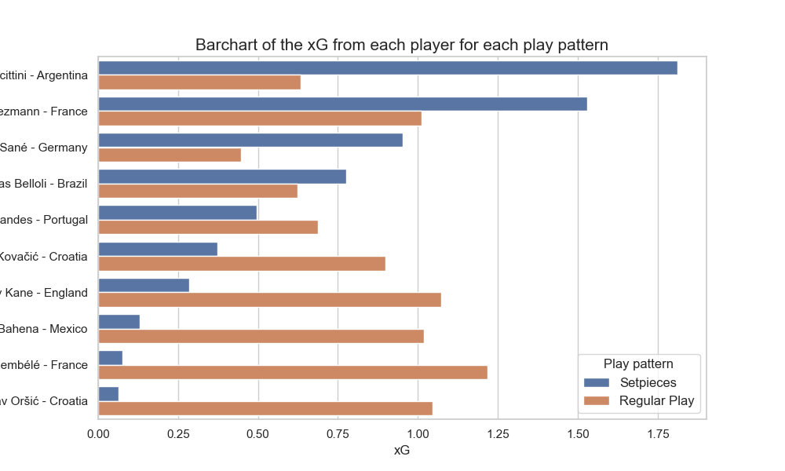

# First Analysis of pass patterns by teams and players in the World Cup 2022 using StatsBomb free data
In this repository I'll use StatsBomb free data from the WC2022 to make an initial analysis of pass patterns by teams and players. In particular, I'll try to find the best teams in set pieces and the most decisive players in regular plays. 

## Introduction
Football is a sport that has been played for centuries, but it's only in recent years that it has become a hotbed for analytics and data-driven insights. Now, teams and coaches are using data to drive decision-making and gain a competitive edge. Like sports data specialists, I am a sports fan and in this project I want to combine my love for football and data and use today's techniques to analyse and draw conclusions. I aim to identify the top-performing teams in set pieces and highlight the most influential players in regular gameplay.

## The data
StatsBomb are committed to sharing new data and research publicly to enhance understanding of the game of Football. Therefore they have made certain leagues of StatsBomb Data freely available for public use for research projects and genuine interest in football analytics. Here, I use statsbombpy library to acces to the World Cup 2022 data. In this data, I can find from results and line-ups to locations of the passes and the shots. In this project, I'll focus on passes and shots by teams and players.

## Best teams in terms of set pieces.
First of all, after reading the data of every match in the World Cup, I create two dataframes: **passes** and **shots**. From the passes dataframe, I select only passes that lead to shot or goal and that comes from set pieces. In this dataframe I have a column named *pass_assisted_shot_id* which relates to the id of the shot, so I can identify the shot coming from a specific pass.

The next step is to get the **expected goal** of every identified shot. Then, I group by teams and I get the total number of passes from setpieces that lead to a shot or goal and the total expected goals from these shots. Finally, I divide them to obtain the xG per pass and select only teams that made more than 9 passes.

Here is a Barchart of xG per pass from set pieces per team:

In this plot I can observe clearly which teams are good in set pieces. Switzerland leads with an expected goal per pass higher than 0.12. For exemple, i f I search the two finalist I see France in a much higher position than Argentina. With this plot, I can identify which teams excel in set pieces, providing valuable insights to enhance the defensive strategies when facing them. Understanding the strengths of these teams becomes a key asset in formulating effective game plans to secure success on the pitch.

## Most decisive players in regular plays

In this part, I use the same methods to get the passes and the shots coming from these passes but here I separete the expected goals from regular plays and set pieces. Then, I get the top 10 players and I make a barchart to see the results:

In this plot I focus on looking at the overall performance of each player per play pattern. I see that Messi and Griezmann lead in terms of passes coming from set pieces. But in terms of regular plays, it is important to highlight players like Ousmane Dembélé, Harry Kane or Mislav Orsic who thanks to their passes get a high xG.

But how do they create this chances? Where do their passes come from? How they play?

To answer these questions I go deeper in the analysis and I get the location of the passes and the shots and I plot them in a half football pitch:

For exemple, here I have the passes from Harry Kane that leads to a shot or goal. I can observe that english strikers have been very effective on shots coming from Harry Kane's passes because of the difference between goals and xGs. On the other hand, I can see that harry kane often goes down to receive as a link between midfield and forwards. We all know how completely is Harry Kane and we know that he can score easily but also we can see he is a modern nine that goes down a bit in order to link passes in forward positions.

Another example is Ousmane Dembélé. I can see that he plays in the right wing position and is where he creates most of the plays. In this plot, I can observe that while he has a high xG and 2 assists, he generated a small xG compared to the amount of crosses he made. In conclusion, he is comfortable in the right wing position but I think the quality of his passes were not good.

And last but not least Theo Hernández. He is an offensive left back from France. I can see he is quite good in long range passes and he reaches the goal line picking assists.

## Conclusions
In conclusion,this project allows us to identify the best teams in set pieces and the key players who have a significant influence in regular gameplays. This analysis provides information to better prepare defence at set pieces against certain teams and to change the strategy if necessary. In addition, it also helps to be aware of important players of the other teams and their attacking styles of play such as the zone they play in and the passes they usually make.

This is my one of my first project in Sports Analytics and I have enjoyed it and I hope to continue learning and putting into practice all the knowledge I am acquiring.

## Reference

https://statsbomb.com/what-we-do/hub/free-data/

## Contributors

Gabriel Gausachs